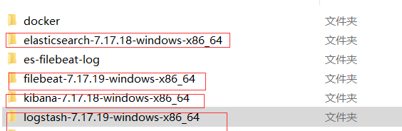
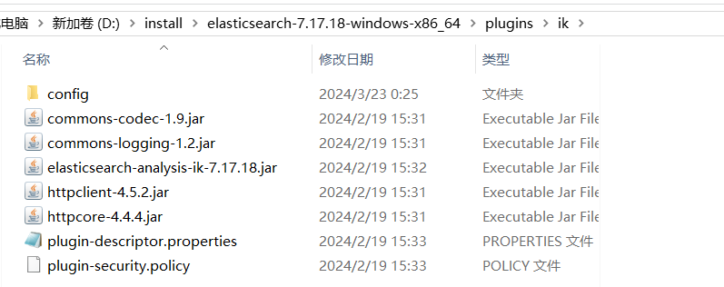
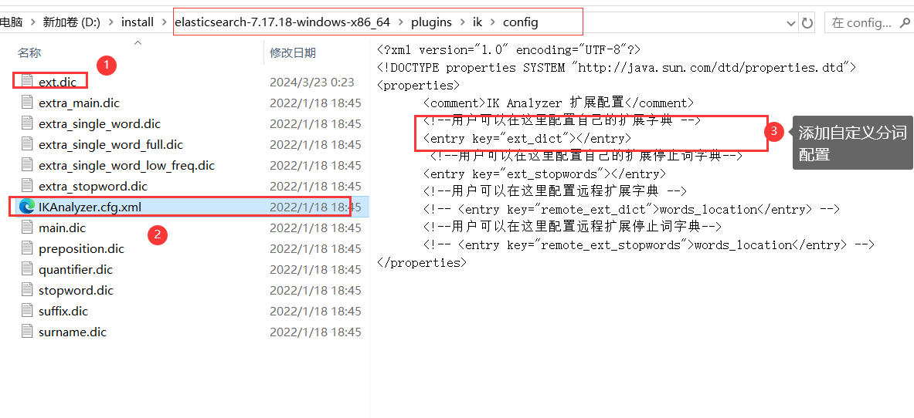
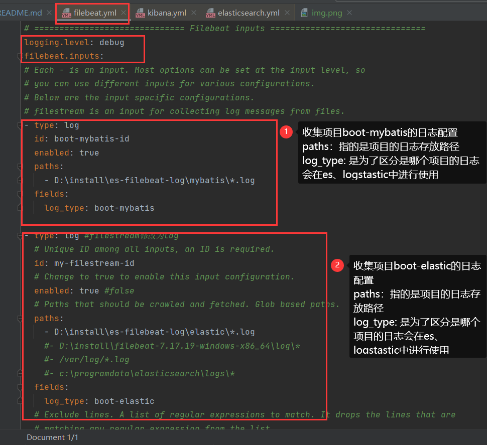
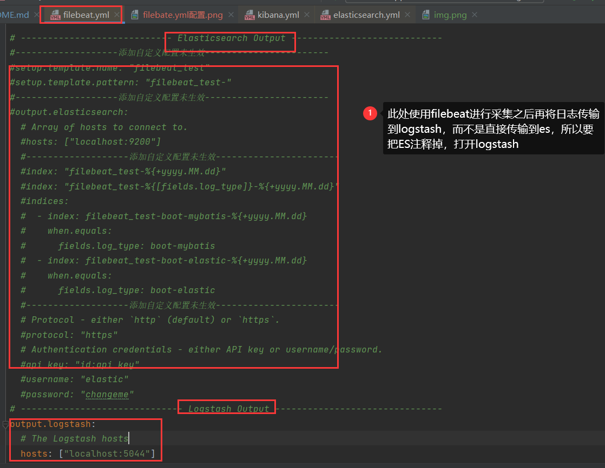
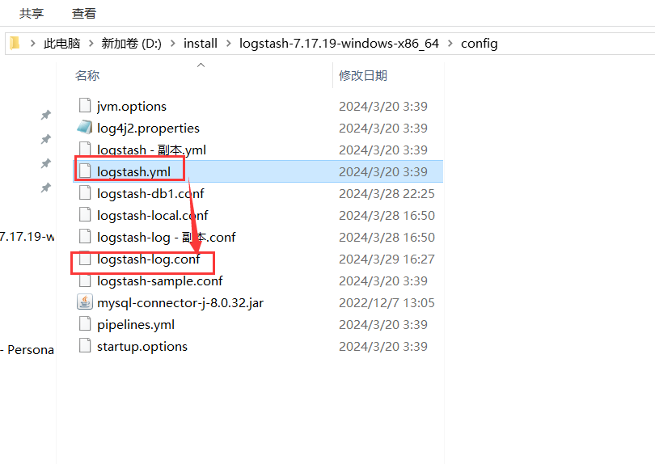
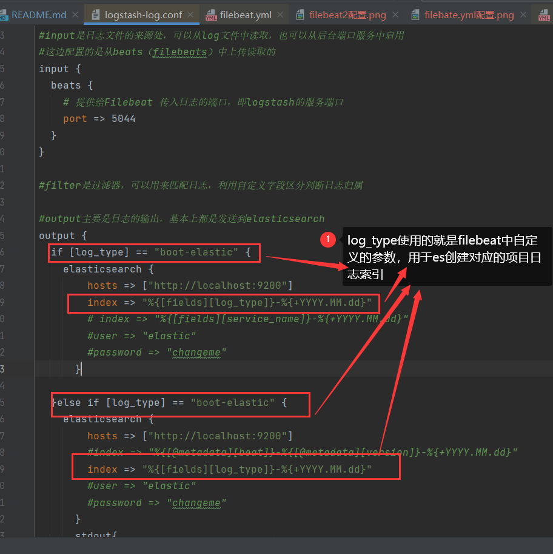
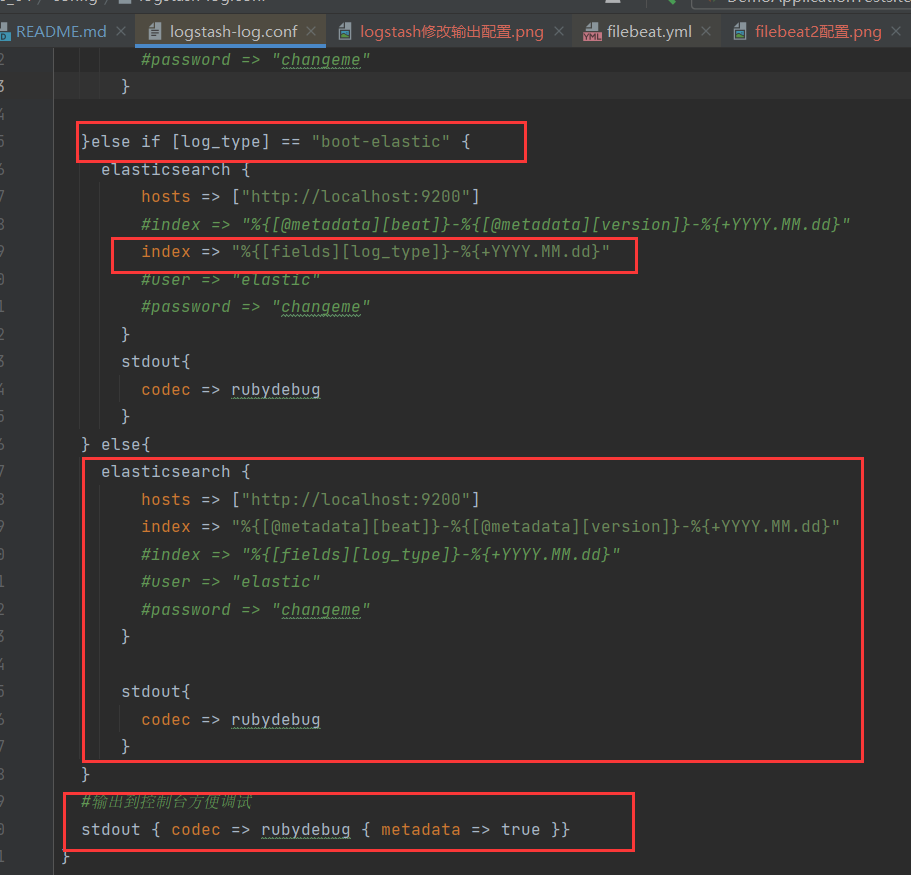

"# lean-boot" 
###项目结构说明
boot-elaticsearch  项目直接访问elasticsearch 进行负责查询功能

boot-mybatis       普通的mysql数据库项目，主要是将日志推送到ELK

#用于测试学习ELK+Filebeat，而做的一些demo
需要使用的到软件安装包
尽量保持各个软件的版本一致，我这主要是网络太慢，就用以前的版本。

##软件安装说明再次就不介绍
###elasticserach解压之后，不需要修改相关配置文件
直接运行成功后

访问 127.0.0.1:9200

####添加iK分词器
1、下载ik分词器并并解压之后
2、在plugins中创建文件夹ik
3、将解压的文件复制到plugins的ik文件夹下,即{elasticsearch-path}\plugins\ik

4、配置自定义分词

###kibana解压之后，无需修改相关配置文件
直接访问 127.0.0.1:5600

###Filebeat解压之后，修改相关配置文件
1、修改D:\install\filebeat-7.17.19-windows-x86_64\filebeat.yml

2、屏蔽ES传输，打开logstash传输

###logstash解压之后，修改相关配置文件
1、复制一份logstash.yml重命名为logstash-log.yml

2、修改配置文件

